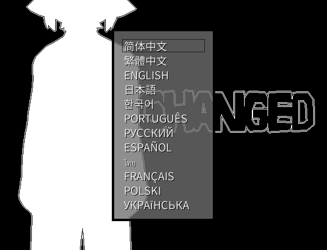
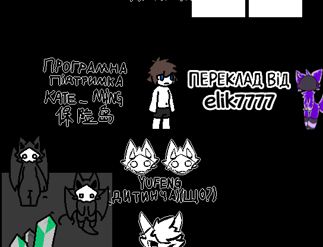
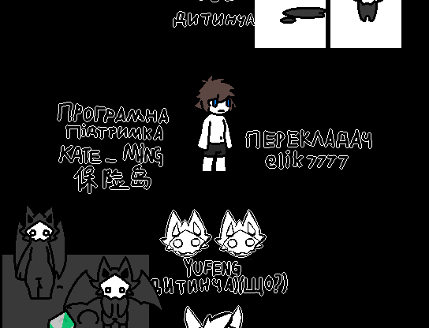
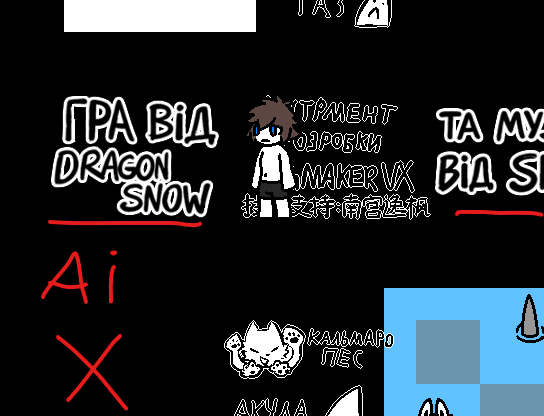
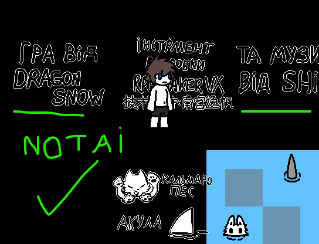
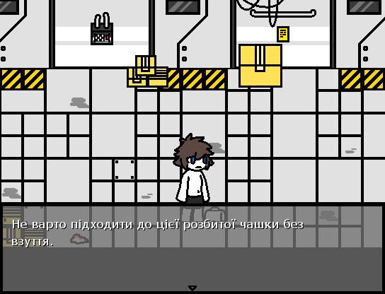
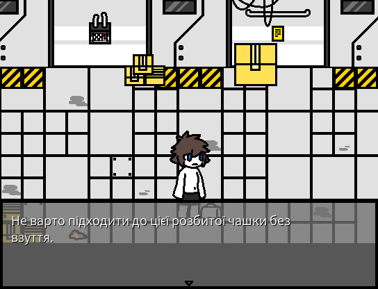
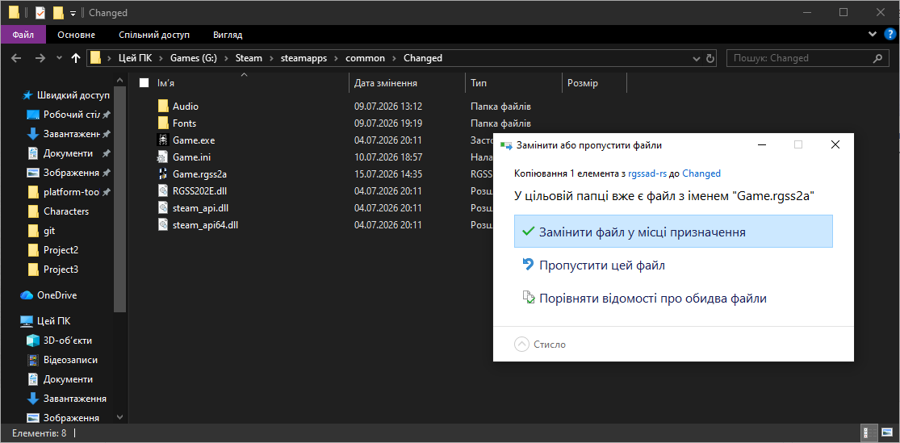
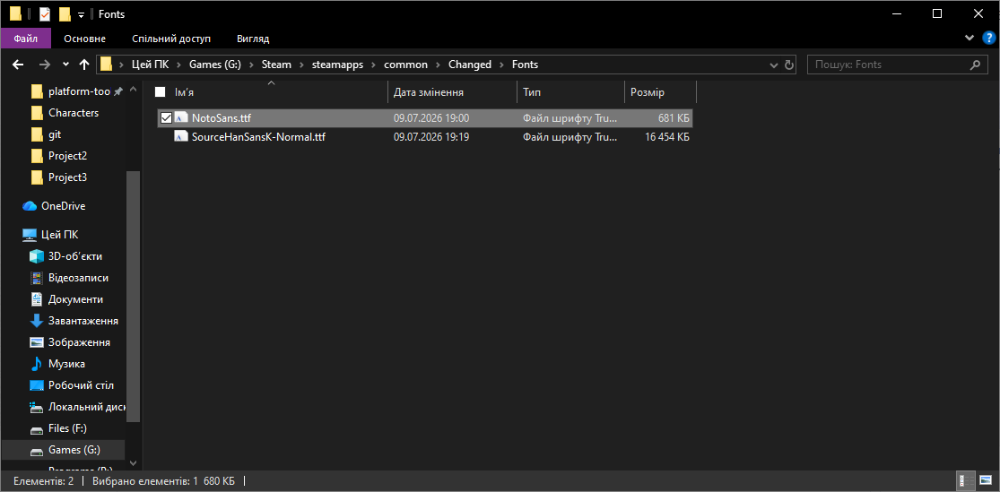
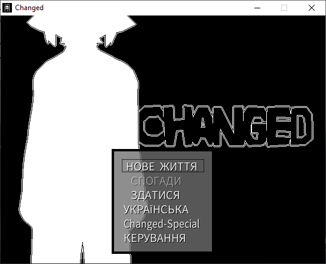

# Повна версія 1.0.73

Повна версія відрізняється пунктами як
* Додані усі мови

* Видалене зайве

### Було

### Стало

* Перероблені усі зображення створенні ШІ

### Було

### Стало

* Перероблений шрифт

### Було

### Стало

 

Завантажити її можна [тут](https://github.com/elik7777/GameChangedUkrainianLanguage/raw/main/Version%20language/1.0.73_full/Game.rgss2a).

Файл шрифту [тут](https://github.com/elik7777/GameChangedUkrainianLanguage/raw/main/Type/1.0.73_full/NotoSans.ttf).                  

---

## Встановлення локалізації

### 1. Завантажте необхідні файли
* Завантажте файл [версії](https://github.com/elik7777/GameChangedUkrainianLanguage/raw/main/Version%20language/1.0.73_full/Game.rgss2a)
* Завантажте файл [шрифту](https://github.com/elik7777/GameChangedUkrainianLanguage/raw/main/Type/1.0.73_full/NotoSans.ttf)

### 2. Замініть файли гри
* Відкрийте папку гри Changed. 
* Перенесіть завантажений файл `Game.rgss2a` у цю папку та підтвердьте заміну файлу.

* Перейдіть у папку `Fonts` та вставте туди файл [шрифту](https://github.com/elik7777/GameChangedUkrainianLanguage/raw/main/Type/1.0.73_full/NotoSans.ttf).
`NotoSans.ttf`

### 3. Запустіть гру
  

---
